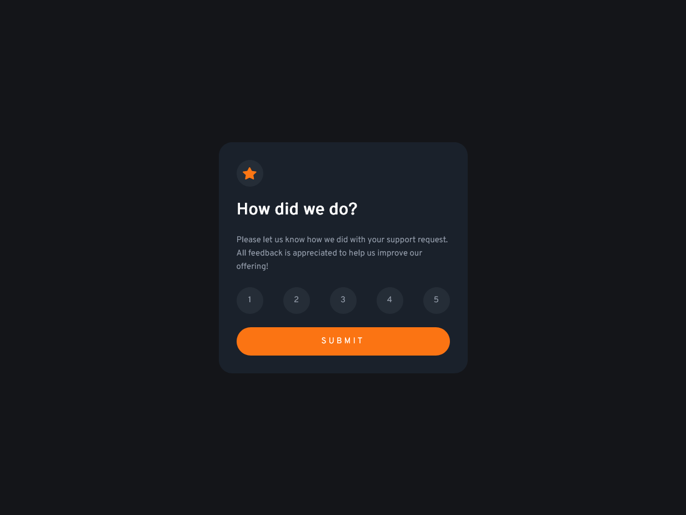

# Frontend Mentor - Interactive rating component solution

This is a solution to the [Interactive rating component challenge on Frontend Mentor](https://www.frontendmentor.io/challenges/interactive-rating-component-koxpeBUmI). Frontend Mentor challenges help you improve your coding skills by building realistic projects.

## Table of contents

- [Overview](#overview)
  - [The challenge](#the-challenge)
  - [Solution](#solution)
  - [Links](#links)
- [My process](#my-process)
  - [Built with](#built-with)
  - [What I learned](#what-i-learned)
  - [Useful resources](#useful-resources)
- [Author](#author)
- [Acknowledgments](#acknowledgments)

## Overview

### The challenge

Users should be able to:

- View the optimal layout for the app depending on their device's screen size ✅
- See hover states for all interactive elements on the page ✅
- Select and submit a number rating ✅
- See the "Thank you" card state after submitting a rating ✅

🌟Extra added 🌟

- Star animation added 🌟
- Input validation and error message 🔴

### Solution



### Links

- Solution URL: [Github](https://github.com/JonasStempickij/interactive-rating-component-front-end-challange)
- Live Site URL: [Live Page](https://jonasstempickij.github.io/interactive-rating-component-front-end-challange/)

## My process

### Built with

- Semantic HTML5 markup
- CSS custom properties
- Javascript
- Flexbox
- Mobile-first workflow
- [Sass](https://sass-lang.com/) - Stylesheet language

### What I learned

- Simple pulse animation for little star image

```css
@keyframes pulse {
  from {
    transform: scale(1, 1);
  }

  50% {
    transform: scale(1.5, 1.5);
  }

  to {
    transform: scale(1, 1);
  }
}

.star-icon img {
  animation: pulse 3s infinite;
}
```

- Javascript code for validating user input and show error message

```js
/* if rating provided on submit hide rating card and show thank you card 
else show error with 5000ms timeout
*/
const onSubmit = document
  .querySelector('.submit-btn')
  .addEventListener('click', () => {
    if (ratingResult.innerHTML) {
      const thankYouCard = document.querySelector('.thank-you-card');
      thankYouCard.style.display = 'flex';
      const ratingCard = document.querySelector('.rating-card');
      ratingCard.style.display = 'none';
    } else {
      const error = document.querySelector('.error');
      error.style.display = 'block';
      setTimeout(() => {
        error.style.display = 'none';
      }, '5000');
    }
  });
```

### Useful resources

- [Frontend Mentor Community](https://www.frontendmentor.io/home) - shout out to the #help channel :+1:

## Author

- Frontend Mentor - [@Jonas Stempickij](https://www.frontendmentor.io/profile/JonasStempickij)
- Linkedin - [Jonas Stempickij](www.linkedin.com/in/jonas-stempickij-940b68220)
